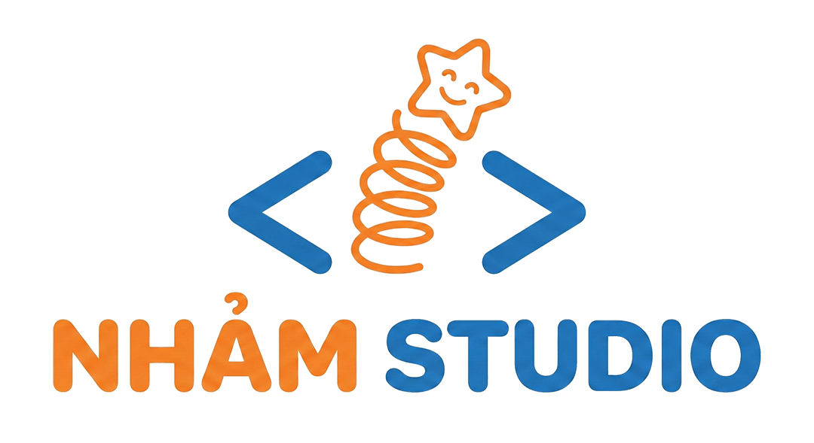
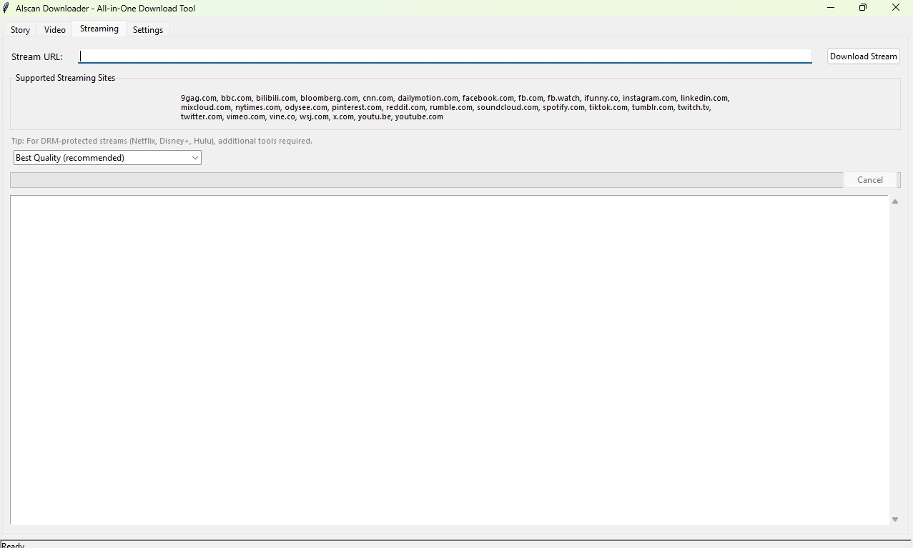

# Nhảm AIO Downloader

An all-in-one download tool for Windows with a tkinter GUI. Download videos from 1000+ sites and save Wattpad stories as EPUB or PDF.



## Features

- **Video Download** — Download from YouTube, Facebook, Twitter/X, Instagram, TikTok, Vimeo, Twitch, and 1000+ sites (powered by yt-dlp)
- **Wattpad Stories** — Fetch story info and download as EPUB or PDF with full Unicode/Vietnamese support
- **Streaming Sites** — Download from any yt-dlp-supported streaming platform
- **Quality Presets** — Simple quality selection: Best, 4K, 1440p, 1080p, 720p, 480p, 360p, Audio Only
- **Auto ffmpeg** — Automatically downloads ffmpeg on first use for DASH stream merging (HD video)
- **Standalone EXE** — Can be built as a single-file Windows executable via PyInstaller

## Screenshots


## Requirements (for running from source)

- Python 3.8+
- pip

### Install dependencies

```bash
pip install -r requirements.txt
```

`requirements.txt`:
```
yt-dlp>=2024.12.0
requests>=2.31.0
beautifulsoup4>=4.12.0
fpdf2>=2.7.0
ebooklib>=0.18
```

## Usage

### Run from source

```bash
python app.py
```

### Build standalone EXE

```bash
pip install pyinstaller pillow
python build_exe.py
```

The output EXE will be at `dist/AIscanDownloader.exe`.

### Download the pre-built EXE

Grab the latest release from the [Releases page]((https://github.com/juverofan/Nham-AIO-Downloader/releases)) — no Python installation needed.

## How it works

| Tab       | Engine     | Description                                   |
|-----------|------------|-----------------------------------------------|
| Story     | Wattpad API v3 + fpdf2/ebooklib | Fetches story metadata/chapters, converts to EPUB or PDF with Vietnamese Unicode support |
| Video     | yt-dlp     | Lists available quality presets, downloads with auto ffmpeg for DASH merging |
| Streaming | yt-dlp     | Same engine, simplified quality presets       |
| Settings  | —          | Output directory, branding, links             |

- **Wattpad**: Uses the official Wattpad API v3 (`/api/v3/stories/{id}`) and the legacy story text API (`/apiv2/storytext?id={part_id}`) instead of HTML scraping.
- **Video/Streaming**: Uses yt-dlp with automatic ffmpeg detection. ffmpeg is downloaded from [BtbN/FFmpeg-Builds](https://github.com/BtbN/FFmpeg-Builds) on first use if not found on PATH.
- **PDF**: Uses system Unicode fonts (Arial, Segoe UI, etc.) with DejaVuSans as fallback — supports Vietnamese and other non-Latin scripts.
- **EPUB**: Generated via ebooklib with proper chapter structure, CSS styling, and optional cover image.

## Project structure

```
aiscan/
├── app.py                    # Entry point
├── build_exe.py              # PyInstaller build script
├── requirements.txt          # Python dependencies
├── logo.png                  # Application logo
├── downloader/
│   ├── __init__.py
│   ├── gui.py                # tkinter GUI (tabs: Story, Video, Streaming, Settings)
│   ├── viddl.py              # yt-dlp wrapper, ffmpeg management
│   ├── wattpad.py            # Wattpad API client
│   └── converter.py          # PDF (fpdf2) and EPUB (ebooklib) generators
└── dist/
    └── AIscanDownloader.exe  # Built standalone EXE
```

## Supported sites (partial list)

YouTube, Facebook, Twitter/X, Instagram, TikTok, Vimeo, Dailymotion, Twitch, Bilibili, Reddit, Pinterest, LinkedIn, Tumblr, Rumble, Odysee, 9GAG, iFunny, SoundCloud, Spotify, Mixcloud, and 1000+ more via yt-dlp extractors.

## License

MIT

## Links

- **Website**: [topvl.net](https://topvl.net)
- **Donate**: [paypal.me/topvl](https://paypal.me/topvl)
- **Developer**: NhảmStudio
